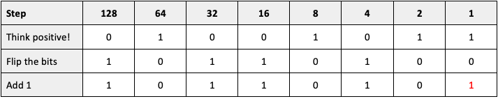
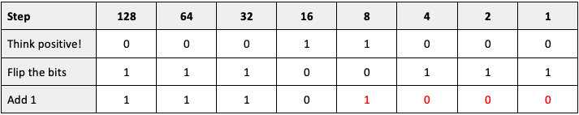

# Storing Negative Numbers (Two's Complement) 

!!! info "What you need to Know"

    **Describe and exemplify the use of binary to represent positive and negative integers using two’s complement, including the range of numbers that can be represented using a fixed number of bits.**

## Sign bits
Negative numbers have a ‘sign bit’ - the first digit of the binary number (closest to the left) is used to show whether the number is positive or negative.

The method for representing `negative numbers` is called `Two’s Complement`.

**Think Positive** - Write out the positive equivalent. For example, if you want to find -89, write out (positive) 89.

**Flip the Bits** - Switch all the 1s to 0s and the 0s to 1s.

**Add 1** - Add 1 to the value of the number. If you’ve got a zero in the last column, write a 1. Otherwise, carry over.

!!! example "Example 1"

    Find the number -75: 

    1. **Think Positive**  - Write out +75

    2. **Flip the Bits** - Flip all the 1s to 0s and the 0s to 1s.	
    
    3. **Add 1** - Add 1 in the last column.

    <figure markdown="span">
        { width="600" }
    <figcaption></figcaption>
    </figure>

!!! example "Example 2"

    Find the number -28: 

    1. **Think Positive**  - Write out +28

    2. **Flip the Bits** - Flip all the 1s to 0s and the 0s to 1s.	
    
    3. **Add 1** - Because it’s an even number, carry over the 1 to the first column that has a 0 and flip the previous 1's to 0's.

    <figure markdown="span">
        { width="600" }
    <figcaption></figcaption>
    </figure>
