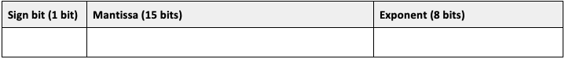
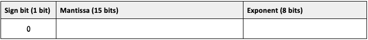
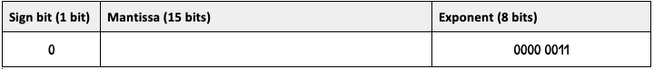
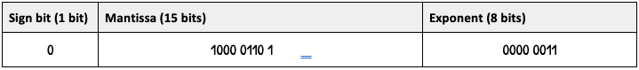
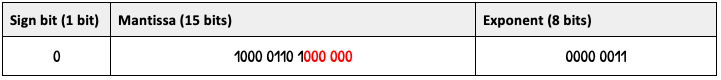
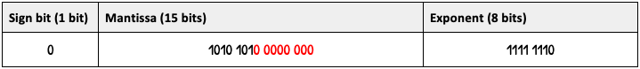
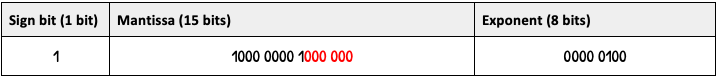

# Representing Floating Point

!!! info "What you need to Know"

    **1. Describe and exemplify floating-point representation of positive and negative real numbers, using the terms mantissa and exponent.**

    **2. Describe the relationship between the number of bits assigned to the mantissa/exponent, and the range and precision of floating-point numbers.**

## Range of floating-point numbers

we want to store the denary (e.g. 12345) number 2 x 108.

We decide to change the number of digits in the exponent from 108 to 1080

> **We can now represent a bigger number**

Floating-point numbers are stored with a certain number of bits allocated for either the mantissa or the exponent. 

**For example**, a certain number might be stored with a 16-bit mantissa, and an 8 bit exponent. 

That means **16 bits are available for the mantissa**, and **8 are available for the exponent**. 

**It can only represent numbers within the range that could be shown with those bits.**

!!! example - 

    We want to store 0.0000000000000000000000009. 
    
    We have an 8-digit mantissa, which isn’t enough to store all of those digits, so we need to round.

    With a maximum of 8 digits, I must represent it as 0.0000001. 
    
    **This is less precise**.

!!! warning "Key Information"

    * **Increasing the available number of bits for the exponent would increase the range.**

    * **Increasing the available number of bits for the mantissa would increase the precision.**

    * **Decreasing the available number of bits in the exponent would decrease the range.**
    
    * **Decreasing the available number of bits in the mantissa would decrease the precision.**

## Representing Floating-Point

In your exam you will be given a number in denary (e.g. 12345) and told how many bits are allocated for the mantissa (usually 16) and exponent (usually 8).

There will also be a sign bit (negative or positive), which comes off the mantissa’s allocation (so a 16-bit mantissa becomes 15).

!!! example

    Convert the number 100.001101 to floating-point representation.

    There are 16 bits for the mantissa (including the sign bit) and 8 bits for the exponent.

    <figure markdown="span">
        { width="600" }
    <figcaption></figcaption>
    </figure>

    Step 1. Find the sign bit. For a positive number, the sign bit is 0. For a negative number, the sign bit is 1.

    <figure markdown="span">
        { width="600" }
    <figcaption></figcaption>
    </figure>

    To convert to floating point, the decimal point must be moved just left of the **“most significant bit”** (the first 1).

    So, **100.001101** becomes **.100001101**:

    <figure markdown="span">
        { width="200" }
    <figcaption></figcaption>
    </figure>

    **The exponent is the number of places the decimal point has moved**. If the point moves left, the exponent is positive. If it moves right, the exponent is negative.
    Here, the exponent is +3, because it has moved 3 places left. 
    
    Step 2. **Write 3 in binary**.

    <figure markdown="span">
        { width="600" }
    <figcaption></figcaption>
    </figure>

    Step 3 - **The mantissa is everything right of the decimal point. So for 0.100001101, the mantissa is 100001101.**

    <figure markdown="span">
        { width="600" }
    <figcaption></figcaption>
    </figure>

    Step 4 - **The mantissa doesn’t use the full 15 bits, so we “pad” it out with 0s on the end, until we reach 15 digits**:

    <figure markdown="span">
        { width="600" }
    <figcaption></figcaption>
    </figure>

The process can be tough to get your head around, but it’s straightforward to do once you get used to it. 

I have listed the steps below: 

1. Choose the sign bit (0 for positive, 1 for negative)
2. Move the decimal point. How many places does it move?

    **`Moves left` = positive exponent**

    **`Moves right` = negative exponent**

3.	Write the exponent in binary (you know how to write a negative number with two’s complement)
4.	Pad the bits with 0s to make the mantissa long enough
(e.g. if you have 1000 and 15 bits, add 0000 0000 000)

??? example "Example - Exponent moving Right"

    Convert `0.001010101` to floating-point. 
    
    There are 16 bits for the mantissa and 8 bits for the exponent.

    1. The number is positive, so the sign bit is 0
    2. The exponent is -2, which is written in two’s complement as 1111 1110
    3. The mantissa is shorter than the full 15 bits, so has been padded with extra 0s

    <figure markdown="span">
        { width="600" }
        <figcaption></figcaption>
    </figure>
   
??? example "Example - Converting a Negative Number"

    Convert `-1000.00001` to floating-point. 

    There are 16 bits for the mantissa and 8 bits for the exponent.

    Notes:

    1. The number is negative, so the sign bit is 1
    2. The exponent is 4, which is written in “normal” positive binary as 0000 0100
    3. This leaves a mantissa of 1000 0000 1, which is padded with extra 0s to reach 15 bits

    <figure markdown="span">
        { width="600" }
        <figcaption></figcaption>
    </figure>

