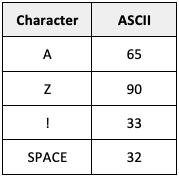

# Representing Text - Unicode

!!! info "What you need to Know"

    **Describe Unicode used to represent characters and its advantage over extended ASCII code (8-bit) in terms of numbers of characters.**

At National 5, you learned that text is stored using a system called **ASCII**, where each letter, number and symbol has an allocated number:

<figure markdown="span">
    { width="150" }
    <figcaption></figcaption>
</figure>

**Standard ASCII uses 7 bits, and extended ASCII uses 8 bits.**

This is only enough to represent 27 or 28 characters, which is 128 or 256 characters respectively. 

This is enough to encode common English-language symbols, like our alphabets (in a-z and A-Z) and digits, and some accented characters, like é or ô, but it isn’t enough for languages that use completely different character sets, like Arabic or Japanese.

Unicode uses 16 bits, so the number of characters it can represent is increased to 216, or 65536.

Like ASCII, each letter, digit or symbol has a numeric code. The first 128 characters are the same as ASCII. 

Unicode then adds other alphabets, symbols, and even emojis. 

The reason emojis appear consistently across devices is that each emoji is actually a unicode character.

You are not expected to memorise actual codes in the exam 

You do need to be able to compare ASCII and Unicode - explaining that Unicode has more bits (1 mark), and can therefore represent more characters (1 mark). This is useful for representing characters from non-English languages such as Mandarin, Arabic or Russian.
