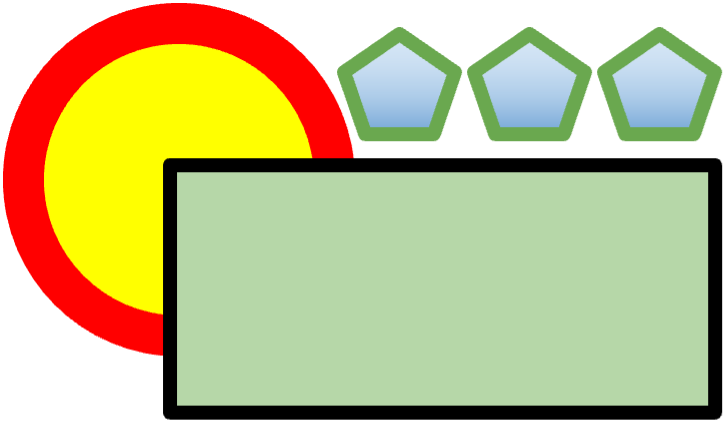

# Bitmaps and Vectors

!!! info "What you need to Know"

    **Describe the relative advantages and disadvantages of bit-mapped graphics versus vector graphics.**

In practice, that means you have to describe briefly what each is, and make some comparisons in terms of file size, editing process, layers, resolution (or not), and the file types used.

## Bitmaps

A bitmap is a grid of pixels **(SQA answer)**. 

Each pixel has a value, which represents the colour of the pixel when shown. 

A black-and-white bitmap might only use 1s for black and 0s for white; a photo from your phone is likely to be 24-bit, which means it can represent 224 different colours (that’s 16777216).

Bitmap files are large, because they have to store every pixel individually. 

For a 24-bit image, that’s 24 bits (3 bytes) for every pixel. 

Consider the storage requirements for an uncompressed 12 mega-pixel image. 

Although .bmp files exist, photos are typically saved as JPEG.

# Vectors

A vector consists of objects with attributes. 

For example, the following vector includes an ellipse  and a rectangle. The rectangle’s fill colour attribute is set to green, and the ellipse’s line thickness attribute is set to 12px.

<figure markdown="span">
    { width="300" }
    <figcaption></figcaption>
</figure>

Because these shapes are stored as separate objects, they can be moved around and re-layered on top of each other without overwriting what is underneath or leaving unwanted gaps.

Examples of other attributes are:

* x and y coordinates
* length
* width

Vectors can be rescaled easily. Zooming in on a vector drawing doesn’t cause any pixelation, as the computer only stores the coordinates and sizes of the object, and can redraw it at the new size without losing quality.

This means it is **resolution independent** - it can be redrawn at any resolution.

