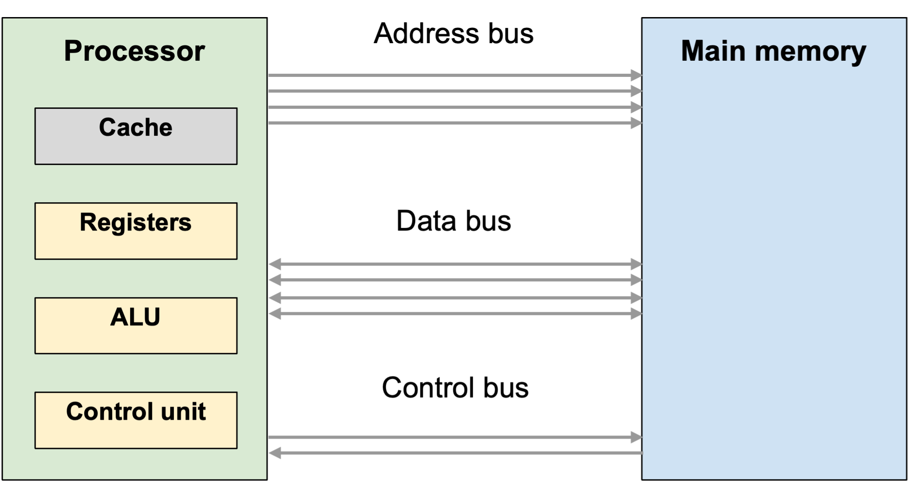

# Computer Structure

!!! info "What you need to Know"

    **1. Describe the concept of the fetch-execute cycle**

    **2. Describe the factors affecting computer system performance:  number of processors (cores), width of data bus, cache memory and clock speed**

To understand the next few sections, it’s helpful to have a diagram here. 

You don’t have to draw it yourself in the exam, but it helps us to understand how the parts all fit together:

<figure markdown="span">
    { width="600" }
    <figcaption></figcaption>
</figure>

Each bus is actually a bundle of wires that connect the two sides. 

As in National 5, the address bus carries the identities  of memory locations, and the data bus retrieves the data in that location and returns it to the CPU.

The control bus is new for Higher, and will be covered below. You don’t need to understand much about the control bus, except that it indicates whether the processor is reading from or writing to main memory.

Inside the CPU, the cache is new. This is a small amount of very fast, but expensive, memory on the same chip as the processor. 

It stores frequently-used data and instructions, and the processor checks this before looking in the main memory. 

If it finds what it’s looking for here, it doesn’t need to fetch it from the main memory. 

**This speeds up the whole process, but it can only store a very few things in the cache at once.**

In the real world, it can be difficult to compare two processors.

On the surface, these are both 2.3 GHz processors. Clearly, one is much more expensive than the other.

The Pentium processor (at the top) is a cheap desktop processor, and the Xeon is a server processor. 

But we need to be able to comment on specifics: what makes one faster or slower, cheaper or more expensive, suitable for home use, or as a powerful server? 

Both operate at a clock speed of 2.3 GHz.

This Computerphile video is a good overview of why clock speed doesn’t necessarily mean one processor is better or faster than another, as well as going over the fetch-execute cycle:

<figure markdown="span">

<iframe width="560" height="315" src="https://www.youtube.com/embed/0UnFN7yyMaA?si=_Zx3jglPn8OhU1F7" title="YouTube video player" frameborder="0" allow="accelerometer; autoplay; clipboard-write; encrypted-media; gyroscope; picture-in-picture; web-share" referrerpolicy="strict-origin-when-cross-origin" allowfullscreen></iframe>

</figure>

!!! info "Key Point"

    For Higher, you need to know about four factors that affect system performance:

    1.	Clock speed
    2.	Number of processors (cores)
    3.	Width of the data bus
    4.	Size of cache memory

1. **Clock speed**
The clock is the electronic unit that pulses at a constant rate, keeping other parts of the processor in sync. Instructions are fetched and executed on each pulse of the clock. The faster the pulse (e.g. how many times per second it operates), the more instructions can be processed in a given amount of time. Increasing the clock speed will mean that the processor gets through its list of  instructions more quickly.

2. **Number of processors (cores)**
Multi-core processors have several sets of processor components on the same chip. A quad-core processor, for example, has four sets of components (or cores) working together. Traditional processors worked on one core. Essentially, this means that two, four or more instructions can be carried out in parallel (at the same time).
A dual-core, or quad-core, processor will be able to process more data on each clock cycle than an equivalent single-core processor. Two 2 GHz cores don’t quite add up to the speed of a single 4 GHz processor - not all work can be done in parallel, so some efficiency is lost. But overall, adding more cores increases performance.

3. **Width of the data bus**
You already know from National 5 that the data bus is a bundle of wires - it’s not a single wire. This bundle of parallel wires can carry a certain amount of data (number of bits) per clock cycle. If more wires are added, this is called increasing the width of the data bus. If we go from 32 parallel wires to 64 parallel wires, we can increase how much data is transferred in each clock cycle.

4. **Size of cache memory**
As explained, the cache is a small amount of very fast memory, usually on the same chip as the processor. Think of it as keeping frequently-used data and instructions close-at-hand, so the processor doesn’t need to reach out and fetch them from the slower main memory. When fetching an instruction or data, the processor checks the cache first, and if it finds it, it doesn’t need to check the main memory. This is called a cache hit. Increasing the size of the cache means that more data can be kept close to the processor, so boosts overall performance.

## The Fetch-Execute Cycle

The fetch-execute cycle is the way in which instructions are fetched from memory and carried out.

There are four steps that you need to know, and be able to put in order:

1.	The processor sets up the address bus with the required address
2.	The processor activates the read line on the control bus to read at that address
3.	The instruction at that address is fetched on the data bus and stored in a register
4.	The instruction is decoded and executed on the processor

<figure markdown="span">
    <iframe width="560" height="315" src="https://www.youtube.com/embed/s6W7KRCSPrQ?si=FhXztULZtYKb8jyK" title="YouTube video player" frameborder="0" allow="accelerometer; autoplay; clipboard-write; encrypted-media; gyroscope; picture-in-picture; web-share" referrerpolicy="strict-origin-when-cross-origin" allowfullscreen></iframe>
</figure>

